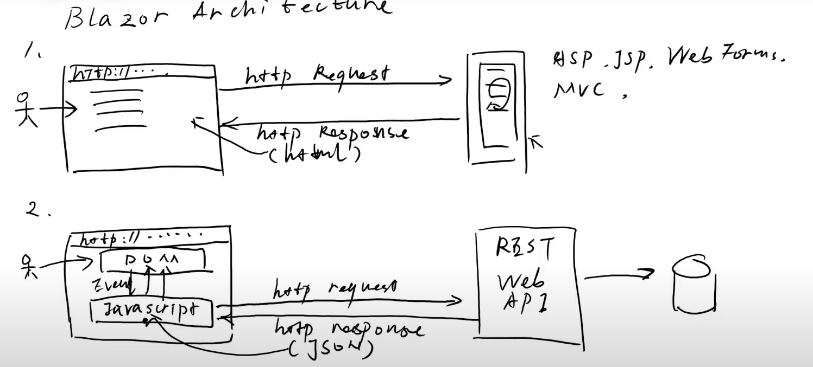
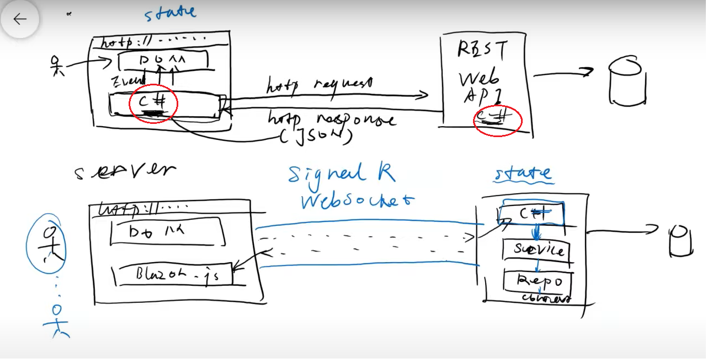
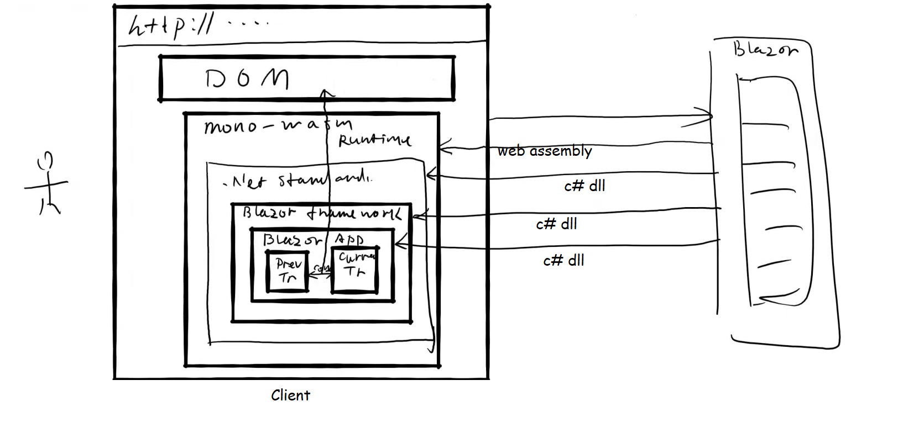
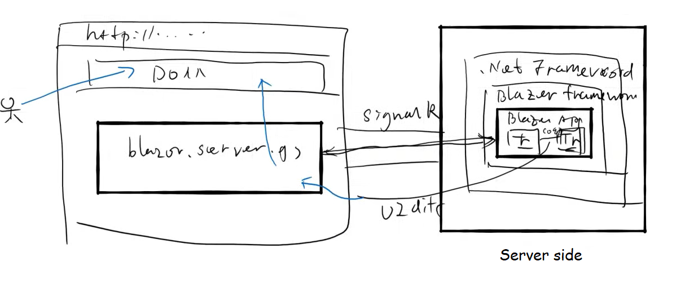

Some notes of Blazor learning.

# Blazor Architecture

Pros and cons of the Blazor WebAssembly.

* Pros: fully utilize the power of the client.
* Cons: slow initial load.

Pros and cons of the Blazor Server.

* Pros: fast initial load.
* Cons: burden on the server / signalR disconnect.

# Reference

1. [Blazor Course - Use ASP.NET Core to Build Full-Stack C# Web Apps](https://www.youtube.com/watch?v=4G_BzLxa9Nw)
